# Cue — Workflow v26
Base: `Cue App v26.dc.html` · updated 2026-10-03
Machine-readable: `cue-workflow-v26.json` · visual map: `Cue Workflow v26.dc.html` · screen images: `screens/`

## Principles
- Idea → Script → Record → Pick → Edit → Ready → Share. Every extra step must justify itself (DESIGN_DIRECTION).
- Context: show the right tool at the right moment; writing looks like writing, recording like recording.
- Color roles: violet #B4A7FF / #9D8CFF = AI (✦, My Cue Voice, Smart); solid yellow #FFD60A = the one primary action or ✓; yellow mono text = HUD signals (counters, time, status).
- Controls follow Cue Controls: selected text chip white/black; selected tile 2px yellow ring + 12% tint; active segment #636366; toggle #34C759; slider 4px yellow track + 24px white thumb.
- Surfaces Night Session: background #0A0B12 with slow aurora, cards #161826, glass rgba(14,16,28,0.6–0.88) + 0.5px violet rim rgba(180,167,255,0.22).
- Bottom 34–44pt (home indicator / multitask) never holds a touch target. Editor panels have fixed height and never scroll vertically; overflow becomes chips or tabs.

## Navigation

### T0 · Tab bar (tab bar)
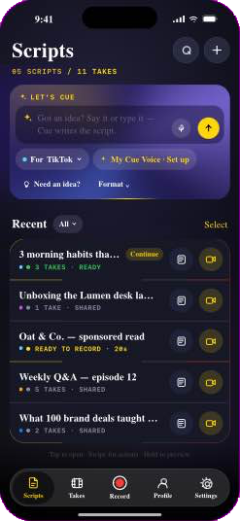
_Cue App v24 · showTabs_

Scripts · Takes · ● Record (center) · Profile · Settings. Glass night, active tab yellow label.

- **Scripts** → S1 Scripts home
- **Takes** → K2 Takes tab
- **● Record** → R0 Record tab
- **Profile** → P1 Profile
- **Settings** → G1 Settings

## Create

### S1 · Scripts home (screen)
 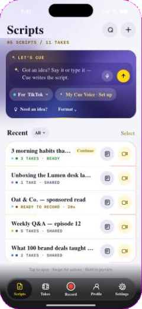
_screen 'home'_

Hero “Let’s Cue!” (violet aurora + yellow scan line): idea field, mic, ✦ arrow, “For TikTok ⌄”, “✦ My Cue Voice”. HUD counter “06 SCRIPTS / 14 TAKES”. Recent list with search and “All ⌄”. Empty state + “Record without a script”.

- **Type idea → ✦** → S3 Script page — AI writes on the page (Draft)
- **Empty idea → ✦** → S2c Need an idea?
- **+** → S2 New script sheet
- **For ⌄** → S5 Create for
- **✦ My Cue Voice** → V1 My Cue Voice flow — or P1 when set
- **Tap row** → S3 Script page
- **Swipe › Record** → R1 Selfie recorder
- **Swipe › More** → S3 Script page — context menu
- **Swipe › Delete** → S1 Scripts home — Undo toast
- **Record without a script** → R1 Selfie recorder — freestyle

States: row status = pipeline stage of its takes (● 3 TAKES · READY) · empty library

### S2 · New script sheet (sheet)
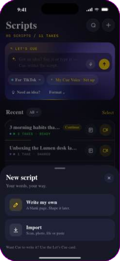 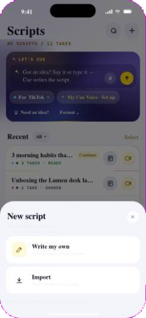
_sheet 'newscript'_

Only Write my own / Import (the AI prompt lives in S1, not repeated here).

- **Write my own** → S3 Script page — empty Draft
- **Import** → S2b Import

### S2b · Import (sheet)
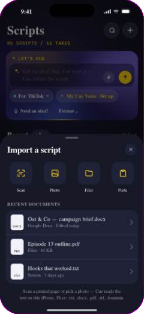
_sheet 'imp'_

Scan, Photo (text recognition), File, Paste.

- **Pick source** → S3 Script page

### S2c · Need an idea? (sheet)
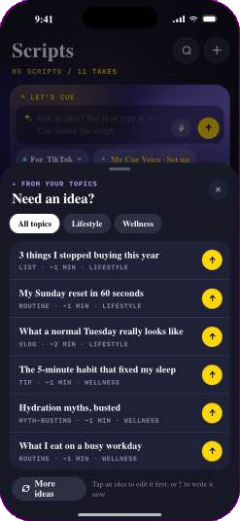
_sheet 'ideas'_

Ideas from the creator’s topics (My Cue Voice).

- **Pick idea** → S3 Script page

### S2d · Format (sheet)
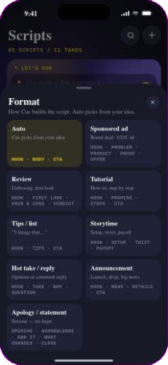
_sheet 'fmt'_

How Cue structures the script (hook, list, story…).

- **Pick format** → S1 Scripts home

### S3 · Script page (screen)
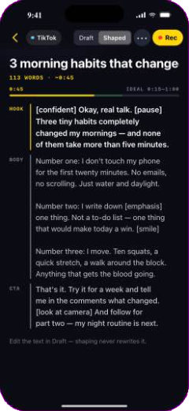 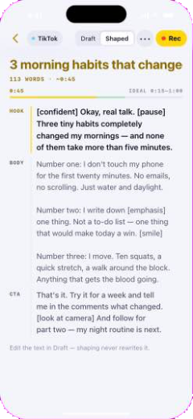
_screen 'script' · CueScriptPage.dc.html_

Single page, Draft | Shaped. AI writes into the page (violet). Free writing first; “Shape for TikTok” adapts to cues and platform rules on demand.

- **Record** → R1 Selfie recorder
- **Shaped** → S3 Script page — cues + platform timing
- **••• › Versions & options** → S4 Script editor (legacy)
- **Hook strip** → S6 Hooks
- **Back** → S1 Scripts home

### S4 · Script editor (legacy) (screen)

_CueScriptEditorEmbed.dc.html_

Versions, blocks, cues (yellow = creator marks), “✦ Improve with Cue” (violet).

- **Done** → S3 Script page

### S5 · Create for (sheet)
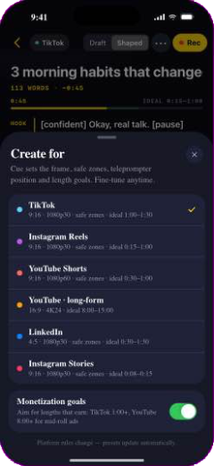
_sheet 'dest'_

Platform presets (aspect, length, safe zones).

- **Pick platform** → S1 Scripts home

### S6 · Hooks (sheet)
_sheet 'hooks'_

Hook variations (✦ violet, Pro).

- **Pick hook** → S3 Script page

## My Cue Voice

### V1 · My Cue Voice flow (flow (sheet))
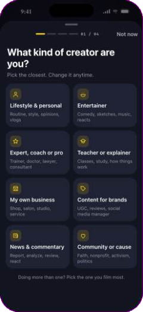 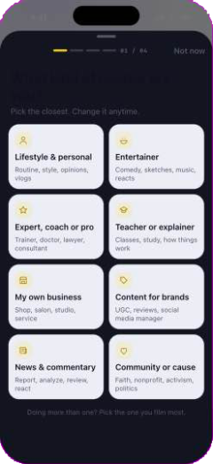
_CueVoiceFlow.dc.html (prop start)_

4 questions 01/04 → role · topics (12 + more, sub-niches) · audience · tone. Then the script is the preview: “My voice | Without”, Sounds like me / Adjust (scope: this script | profile).

- **Not now** → S1 Scripts home — progress kept: “2 questions left · Finish”
- **Write my script** → S3 Script page
- **Done (no idea typed)** → S1 Scripts home
- **Edit a row** → P1 Profile

States: never set · partial · ready · no Apple Intelligence

## Record

### R0 · Record tab (sheet)
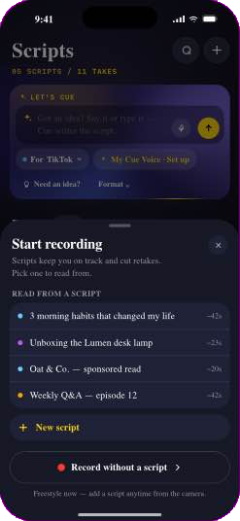 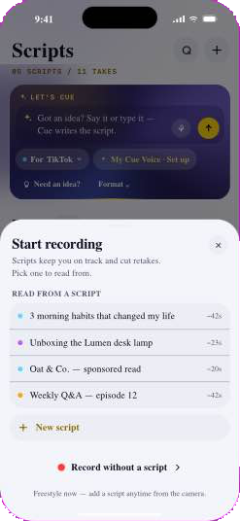
_sheet 'pre'_

Pick a script to record — or go freestyle.

- **Pick script** → R1 Selfie recorder
- **Freestyle** → R1 Selfie recorder

### R1 · Selfie recorder (screen)
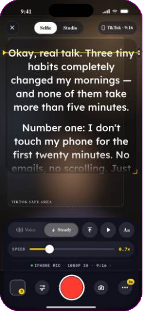 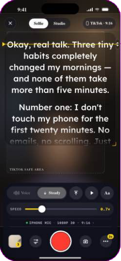
_screen 'selfie'_

Bar 4a (glass night): [Voice | Steady] + ⤒ + play + Aa · SPEED slider (Steady) or hint (Voice) · HUD line ● MIC · SETUP › · last take · camera settings · ● record · flip · •••.

- **Aa** → R3 Recorder sheets — disp
- **Camera settings** → R3 Recorder sheets — cam
- **HUD mic** → R3 Recorder sheets — ain
- **HUD setup ›** → R3 Recorder sheets — stake
- **•••** → R3 Recorder sheets — Countdown · Remote · This take
- **Last take** → K1 Take review
- **● Record** → R4 Stop → take saved

States: prep (full bar) · countdown · recording (compact bar: mode chip, ⤒, pause, Stop, 00:23 yellow, TAKE 4 · TIKTOK SETUP) · tap screen → full bar for 4s · platform recommendation card · freestyle (no script → Add script)

### R2 · Studio recorder (screen)
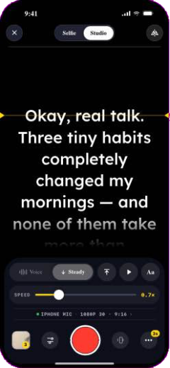
_screen 'studio'_

Same bar as Selfie; Remote replaces flip; REC pill on top; full-screen text.

- **Remote** → G4 Remote
- **● Record** → R4 Stop → take saved

### R3 · Recorder sheets (sheets)
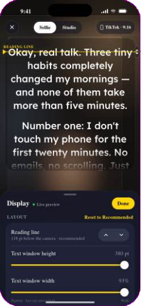
_disp · cam · ain · stake_

Display (Aa), Camera & recording, Audio input, This take (recommended vs your setup).

- **Close** → R1 Selfie recorder

### R4 · Stop → take saved (state)
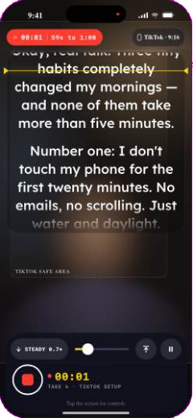
_recPress / stopWarn_

Stop early → “Keep going” warning. Stop → take added to the script → review.

- **Take created** → K1 Take review

## Takes & review

### K1 · Take review (screen)
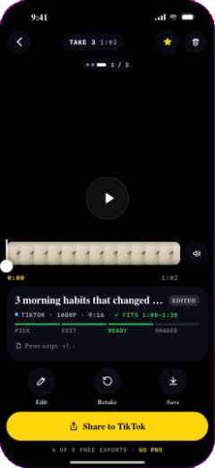
_screen 'review'_

Paused by default (play button). Top glass: back · TAKE 3 · 1:02 · ★ ring · delete. Compare chip “2 / 3” + swipe. Strip scrub + mute. Panel: title, HUD line (✓ FITS), PICK·EDIT·READY·SHARED bar, From script ›, ✦ suggested best (violet). Actions: Continue/Edit · Retake · Save (round glass) + Share to <platform> (yellow). 4 OF 5 FREE EXPORTS · GO PRO (no watermark, ever).

- **Edit / Continue** → E1 Editor
- **Retake** → R1 Selfie recorder
- **Save** → K3 Share / Save
- **Share** → K3 Share / Save
- **★** → K1 Take review — marks best, unmarks siblings
- **Delete** → K2 Takes tab — Undo toast
- **From script ›** → S3 Script page
- **Go Pro** → M1 Cue Pro

### K2 · Takes tab (screen)
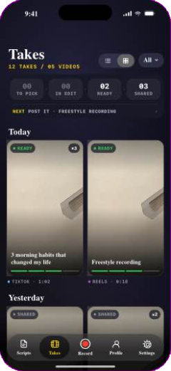 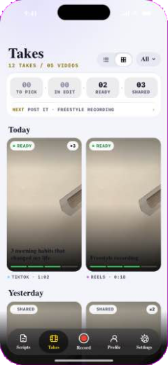
_screen 'takes'_

Pipeline TO PICK › IN EDIT › READY › SHARED (counts, tap = filter) + NEXT line. Grid 9:16 (default) or list. Platform “All ⌄”. Swipe Share/Delete, hold = peek.

- **Tap video** → K1 Take review
- **NEXT** → K1 Take review — oldest waiting video
- **Swipe Share** → K3 Share / Save
- **Peek › Edit** → E1 Editor
- **Peek › Retake** → R1 Selfie recorder

### K3 · Share / Save (sheet)
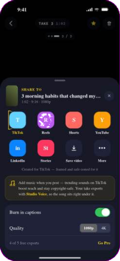
_sheet 'share' · exportTake()_

Share to platform or Save to Photos. Clears draft, sets exported → SHARED. Free: decrements exportsLeft; at 0 → paywall.

- **Done** → K1 Take review
- **0 exports left** → M1 Cue Pro

## Editor

### E1 · Editor (screen)
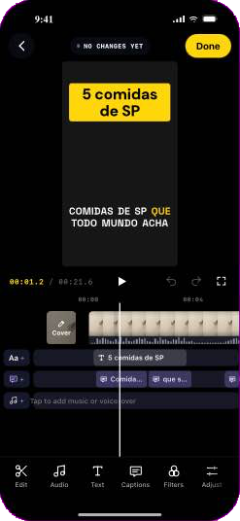
_screen 'qedit' · CueEditorEmbed.dc.html_

Top: back (keeps draft, no question) · IN EDIT · AUTOSAVED · Done (yellow). Preview, transport (00:12 / 00:42 mono). Timeline: Cover tile, main track, lanes Aa (white) · captions (violet) · music (green) · voice-over (amber) · overlay (light blue), chips “Aa +”. Toolbar (CapCut order): Edit, Audio, Text, Captions, Filters, Adjust, Crop, Background, Overlay, ✦ Smart. Clip selected: white frame + yellow handles, Delete fixed red.

- **Tool** → E2 Editor panels
- **Done** → E3 Is it ready to post?
- **Back** → K1 Take review — draft → IN EDIT

### E2 · Editor panels (panels)
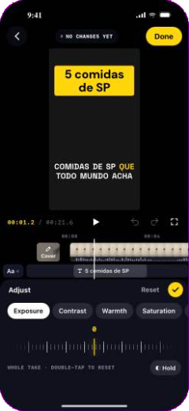
_vPanel()_

Fixed height (header 44 · content ≈176) above system zone. One parameter at a time: chip pager when content overflows. Adjust = chips + ruler + ◐ hold; Text = Style·Font·Color·Motion; Cover = Frame·Text·Elements·Look, Preview: Feed | Profile grid (3×3 series grid, this cover ringed yellow) (layouts, ✦ titles, highlight word, arrow/circle/EP/NEW/@handle, Text behind me, My cover style); Smart = captions, pauses, Studio Voice, auto adjust; Captions = horizontal line cards.

- **✓** → E1 Editor

### E3 · Is it ready to post? (sheet)
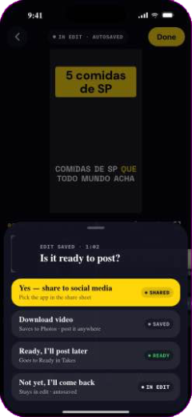
_sheet 'donq'_

Asked every time the creator taps Done. Header “EDIT SAVED · 1:02” — no platform names; sharing is generic.

- **Yes — share to social media** → K3 Share / Save — → SHARED · pick the app in the share sheet
- **Download video** → K1 Take review — Saves to Photos · counts as export → SHARED
- **Ready, I’ll post later** → K1 Take review — → READY + Share glow
- **Not yet, I’ll come back** → K1 Take review — → IN EDIT · Continue
- **Swipe down** → E1 Editor

### E4 · Editor sheets (sheets)
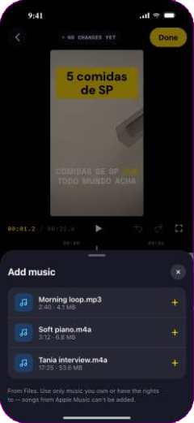
_music · media_

Add music (Files), Add photo or video.

- **Pick** → E1 Editor

## Profile · Settings · Pro

### P1 · Profile (screen)
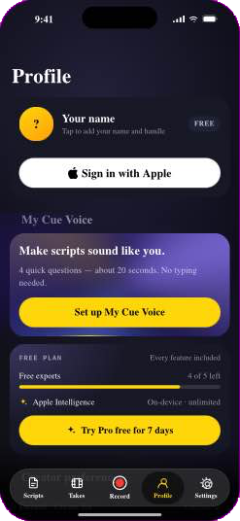 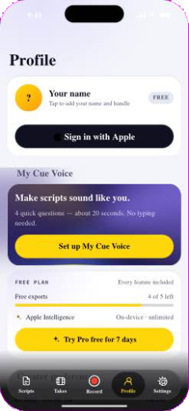
_screen 'profile'_

Who I am / how I create: identity, My Cue Voice card (What Cue uses, editable rows, voice examples), Creator preferences, plan card (FREE PLAN or ● PRO ACTIVE, night aurora).

- **Edit a voice row** → V1 My Cue Voice flow
- **Try Pro** → M1 Cue Pro
- **Manage** → M1 Cue Pro

### G1 · Settings (screen)
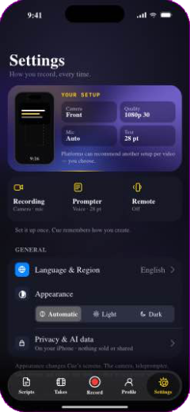 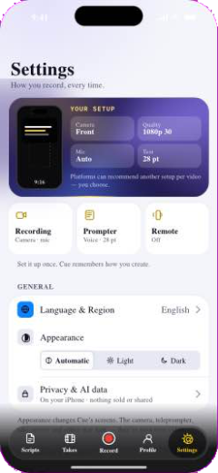
_screen 'settings' · setPage 'root'_

How the app behaves: Your setup card (Camera, Quality, Mic, Text → pages), tiles Recording · Prompter · Remote, General (Language & Region, Appearance, Privacy & AI data), Purchases & About, Reset Creator Setup.

- **Recording** → G2 Recording
- **Prompter** → G3 Teleprompter
- **Remote** → G4 Remote
- **Language & Region** → G5 Language & Region
- **Acknowledgements** → G6 Acknowledgements
- **Restore purchases** → M1 Cue Pro

### G2 · Recording (screen)
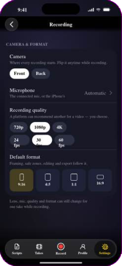
_setPage 'rec'_

Camera, mic, quality, format defaults.

- **Back** → G1 Settings

### G3 · Teleprompter (screen)
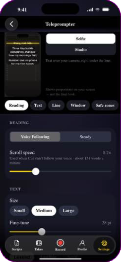
_setPage 'tp'_

Sticky proportional preview (static) + section chips: Reading, Text, Line, Window/Safe zones (Selfie) or Background (Studio), While recording.

- **Back** → G1 Settings

### G4 · Remote (screen)
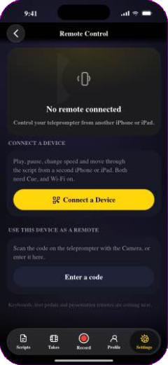
_setPage 'remote'_

Hero ring grey/yellow/green, QR pairing, Use this device as a remote.

- **Back** → G1 Settings

### G5 · Language & Region (screen)
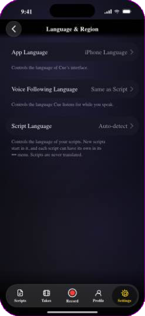
_setPage 'lang'_

App, voice-following and script language.

- **Back** → G1 Settings

### G6 · Acknowledgements (screen)
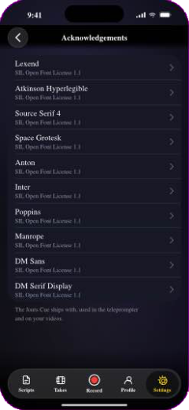
_setPage 'ack'_

Fonts and licenses.

- **Back** → G1 Settings

### M1 · Cue Pro (sheet)
 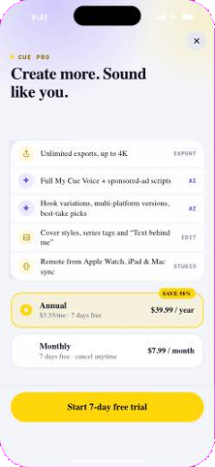
_sheet 'pay' · payCtx_

Night + violet/yellow aurora, ● CUE PRO mono, benefits card (AI rows violet), plans (2px yellow ring), glass footer CTA. Export context shows 05 / 05 FREE EXPORTS USED meter.

- **Buy** → K1 Take review — isPro → unlimited
- **Close** → K1 Take review

## State machines

### Video pipeline (per video = takes of one script)
First match: >1 take and none ★ → PICK BEST · draft open → IN EDIT · not exported → READY · exported → SHARED. Never set by hand.

- ★ best: PICK → READY
- Change in editor + Back: → IN EDIT
- Done › Ready later: IN EDIT → READY
- Done › Share / Download · Share · Save: → SHARED
- Reopen + change: READY/SHARED → IN EDIT

### Recorder
idle → countdown (•••) → recording (compact bar) → stop (warn if very short) → take saved → review

- ● (countdown on): idle → countdown
- ● / timer end: → recording
- tap screen: compact ↔ full bar 4s
- ■: recording → take → K1

### Free / Pro
Free: 5 exports, 5 AI scripts / month; every feature visible. Pro = “I want more of this”, never a lock.

- Export with 0 left: → M1 (export context)
- Buy: free → pro

## Open inconsistencies
- **I04 [low] State** — Leftover state from removed features: hideUi / autoHide (old “Hide controls”), tView / takeViews (old Takes filters), setPage alias “creator”. _Fix:_ Remove dead state and branches.
- **I06 [low] S1 Scripts** — Two auroras on the same screen (hero card 24 s + background 48 s). _Fix:_ Check together on device; slow or dim the background if busy.
- **I08 [low] E2 Adjust** — Adjust applies to the whole take only (no This clip | All clips). _Fix:_ Add per-clip adjust in the data model if needed.
- **I09 [low] E2 Cover** — “Text behind me” is simulated with a fixed mask. _Fix:_ Implement with Vision person segmentation on device.
- **I11 [low] S2d / S2c** — Ideas and Format sheets come from the older AI flow; confirm they still match the Draft | Shaped script page. _Fix:_ Review copy and entry points.

## Resolved
- **I05 Appearance** — Light mode finished (tabs, script page, sheets, My Cue Voice); video screens always dark; Automatic follows iOS. Tokens: `CUE_COLORS.md`.
- **I01 K1 Take review** — Watermark badge and state removed.
- **I02 E1 Editor** — Editor export sheet is unreachable in the app (export routes to Done › question); kept only for standalone embed.
- **I03 Jump to a flow** — Jump labels: Editor, Takes pipeline, Share, Profile · My Cue Voice.
- **I07 E2 Cover** — Profile grid shows a 3×3 series grid in the cover font.
- **I10 Naming** — Panel and tile both say “Studio Voice”.

## Improvements
- Give every node a deep link (cue://K1?take=…) and an analytics event (screen_view + action) named after this map.
- Haptics map: light on chip/tile pick, medium on ● record and Done, success on Share.
- One shared “glass” and “chip” component in SwiftUI so the color rules can’t drift.
